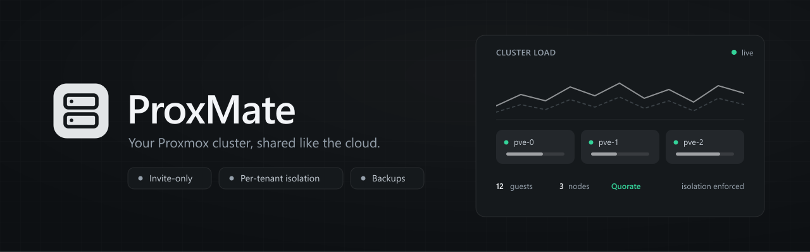
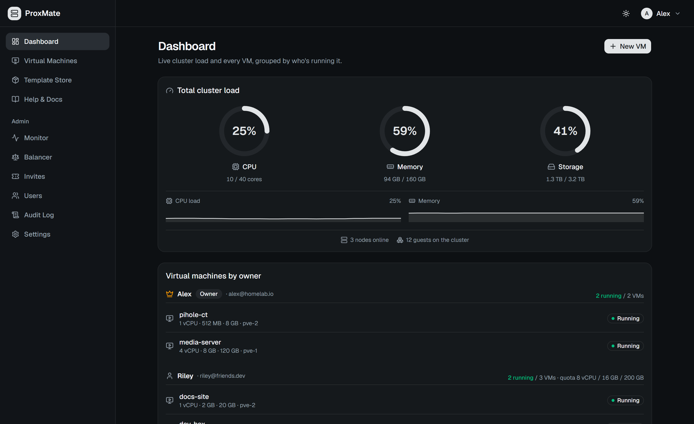
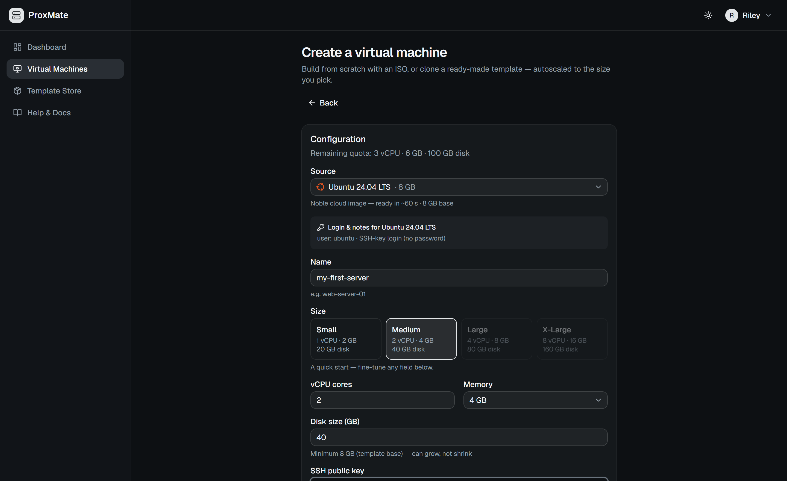
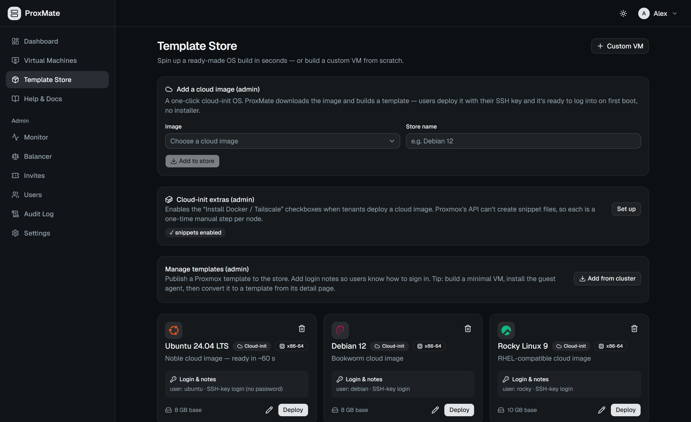
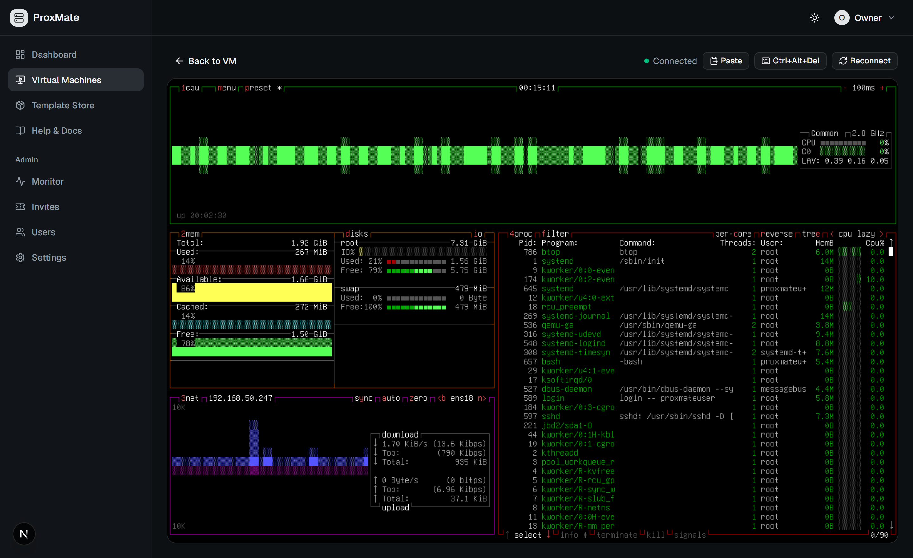
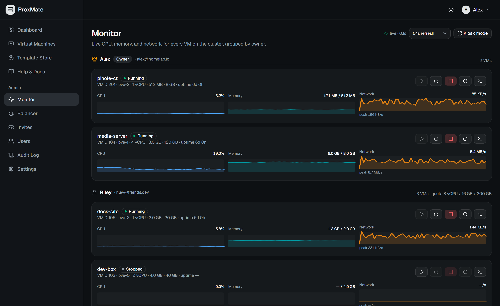
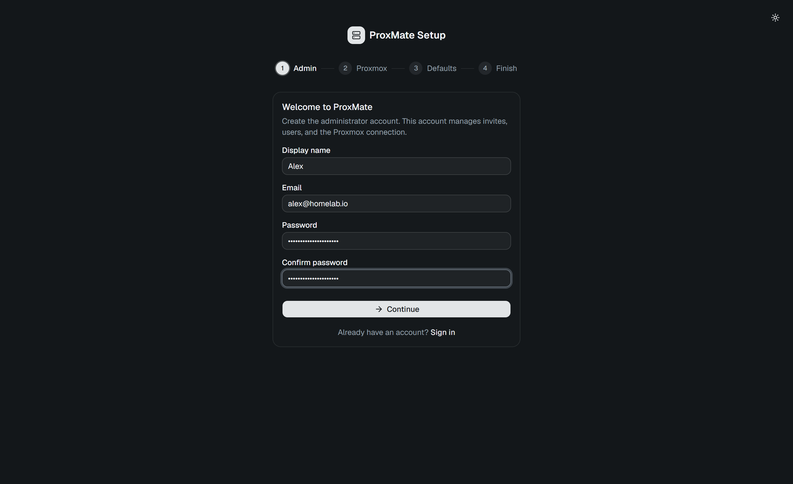

<div align="center">



<br/>

<p>
  
  
  
</p>

**A cloud infrastructure control plane built on Proxmox VE.**

Proxima gives you a modern, production-grade WebUI on top of your existing Proxmox cluster.
Manage invite links with resource quotas, let users spin up VMs and LXC containers —
from an ISO, a template, or a one-click cloud image (paste an SSH key → a ready-to-SSH
box in ~60 s) — and access them via an in-browser console, all without exposing your
Proxmox admin panel.

**A product of [Conzex Global Private Limited](https://www.conzex.com).**

</div>

---

## Features

- **Invite-only multi-tenancy** — invite links carry CPU/RAM/disk quotas; a per-VM firewall keeps tenants off your LAN, your other guests, and the host **once the Proxmox cluster firewall is enabled** (Proxima walks you through that in-app)
- **VMs & LXC containers** — create from an ISO, the Template Store, or 20 curated cloud images (16 x86-64 + 4 ARM64); resize, rebuild, rename, snapshots, power schedules, tags & bulk actions
- **Share a VM** — hand another tenant access at one of three preset levels (Viewer / Operator / Manager); no share level can delete, rebuild, migrate, or re-share
- **In-browser consoles** — graphical (noVNC) *and* a text console with clickable links, real copy/paste, and scrollback — no SSH, no open ports
- **Proxima IDE (beta)** — a per-VM **browser IDE** (VS Code / code-server) with an **in-guest AI coding agent** wired to admin-controlled models — [docs](docs/proxima-ide.md)
- **Serious auth** — TOTP 2FA, passkeys (WebAuthn), OIDC SSO, SMTP password resets, optional invite-enforced 2FA
- **Time-boxed access** — invites can grant a fixed term (or never expire); when a window closes Proxima **suspends, never deletes** — VMs stop, sign-in is refused, nothing is destroyed
- **MateStates backups** — scheduled backups with rolling retention, one-click in-place restore, per-VM policies, quick snapshots — plus nightly backups of **Proxima's own database**
- **Cluster operations** — automatic VM placement, live migration, DRS-style memory balancer, maintenance node-drain, GPU/PCI passthrough requests
- **Operator visibility** — live admin monitor (1 Hz sparklines), monitoring-only rack-panel kiosk, audit log, Prometheus `/metrics`
- **In-app updates** — check the latest release and one-click rebuild onto it

<details>
<summary><b>Tech stack</b></summary>
<br/>

| Layer | Technology |
|---|---|
| **Frontend** | Next.js 16 (App Router), TailwindCSS v4, Shadcn/UI (Base UI), react-icons |
| **Backend** | Node.js, Express 5, `ws` (WebSocket relay), `express-rate-limit`, `node-cron`, `nodemailer` |
| **Database** | SQLite via Prisma ORM (migrations); PostgreSQL supported for scale-out |
| **Auth** | JWT + bcrypt, OIDC SSO (`openid-client`), Passkeys (`@simplewebauthn/server`), TOTP 2FA (`otplib`), SMTP |
| **Proxmox** | REST API with API Token authentication |
| **Console** | noVNC (graphical) + xterm.js (text) over a WebSocket proxy |
| **Testing / CI** | Vitest, Playwright, GitHub Actions |

</details>

---

## Screenshots

<div align="center">


*Live cluster capacity and every virtual machine at a glance*

</div>

<details>
<summary><b>More screenshots</b> — create wizard, Template Store, console, live monitor, setup (5)</summary>
<br/>
<div align="center">

### Create a VM

*One wizard for custom (ISO), template, and cloud-init deploys — paste an SSH key and tenants are auto-placed on the best node*

### Template Store

*Add cloud images in one click and publish ready-made OS builds — OS-matched icons, login notes, deploy in seconds*

### In-Browser Console

*A live, interactive noVNC session on your VM — copy/paste and Ctrl+Alt+Del, no SSH or open ports needed*

### Live Monitor

*Per-VM CPU / memory / network sparklines at 1 Hz, with power controls*

### First-Time Setup

*Guided wizard to create the admin account and connect your Proxmox cluster*

</div>
</details>

---

## Install

One command, from a clean Linux machine to the setup wizard:

```bash
bash install.sh
```

The installer checks what your machine is missing — Node.js, npm, git, openssl — and
sets up the environment. It generates your `ENCRYPTION_KEY`, writes a correct `.env`,
builds the stack, and stops at the browser wizard, where the Proxmox token is entered.

---

## Quick start (development)

**Prerequisites:** Node.js 20+, a Proxmox VE cluster (tested on PVE 9.2), and a
[Proxmox API token](https://pve.proxmox.com/wiki/User_Management#pveum_tokens).

```bash
cd proxima

# Backend (Express API on :4000)
cd backend
npm install
cp ../.env.example .env        # edit if needed
npx prisma migrate deploy
npm run dev

# Frontend (Next.js on :3000) — second terminal
cd frontend
npm install
npm run dev
```

Open `http://localhost:3000` — the **setup wizard** walks you through creating the
admin account, connecting Proxmox, and picking storage/network defaults. Then generate
invite links for your users from **Admin → Invites**.

---

## Production deployment (Native Node.js & PM2)

```bash
cd backend && npm install && npx prisma generate && cd ..
cd frontend && npm install && cd ..
npm run build

npx pm2 start deploy/pm2.config.js
```

> **`ENCRYPTION_KEY` must stay constant** across restarts — it decrypts your stored
> Proxmox token, JWT secret, SMTP password, and TOTP secrets. **Keep one copy off the
> host.** `NEXT_PUBLIC_API_URL` is baked into the frontend at **build time**, so rebuild
> the frontend if it changes.

For a real public deployment, serve Proxima from a **single HTTPS origin** (passkeys,
`Secure` cookies, and OIDC SSO require it) behind Caddy / nginx / Traefik or a
Cloudflare Tunnel. The complete runbook is in **[DEPLOYMENT.md](./DEPLOYMENT.md)**.

---

## Testing

The backend ships a Vitest suite covering the security-critical logic — quotas,
the per-VM firewall builder, placement, retention, ownership and share permissions,
compute access windows, and more — against a mocked Proxmox API:

```bash
cd backend && npm test
```

---

## Documentation

| Guide | Audience | What's inside |
|---|---|---|
| [Production runbook](./DEPLOYMENT.md) | Operators | HTTPS origin, Caddy/Cloudflare Tunnel, SSO, SMTP, 2FA matrix, kiosk |
| [Security guide](./SECURITY.md) | Operators | Tenant isolation model, cluster firewall, hardening checklist |
| [Admin guide](./docs/admin-guide.md) | Operators | Cluster prep, API tokens, cloud images, auth settings |
| [External access](./docs/external-access.md) | Users | The "no port forwarding" rule and alternatives |
| [Tailscale for SSH](./docs/tailscale-ssh.md) | Users | SSH into your VM from anywhere |
| [Cloudflare Tunnels](./docs/cloudflare-tunnels.md) | Users | Publish a public website from your VM |
| [REST API](./docs/api.md) | Developers | Personal `pm_…` tokens, OpenAPI spec, `/metrics`, PostgreSQL |
| [Architecture](./project-architecture.md) | Internal | Full system design — request flows, schema, security model |

---

## License & Attribution

Proxima is a proprietary product of **Conzex Global Private Limited**.
See [LICENSE](./LICENSE) for terms. Website: [https://www.conzex.com](https://www.conzex.com)

---

<div align="center">
  <sub>© 2026 Conzex Global Private Limited. All rights reserved.</sub>
</div>
